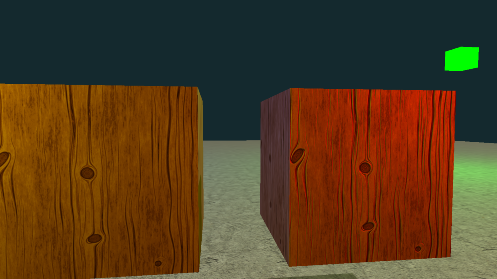
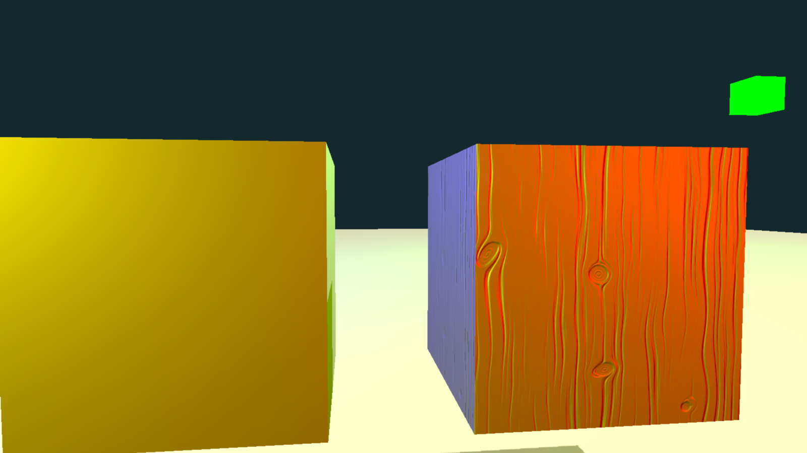
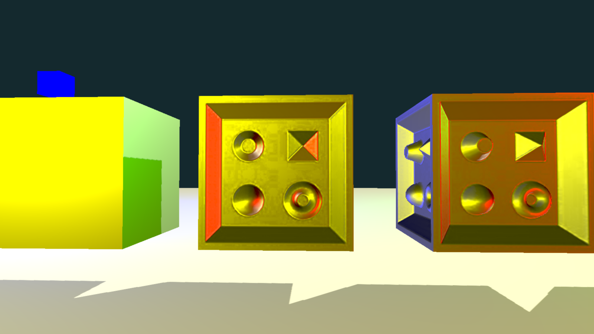
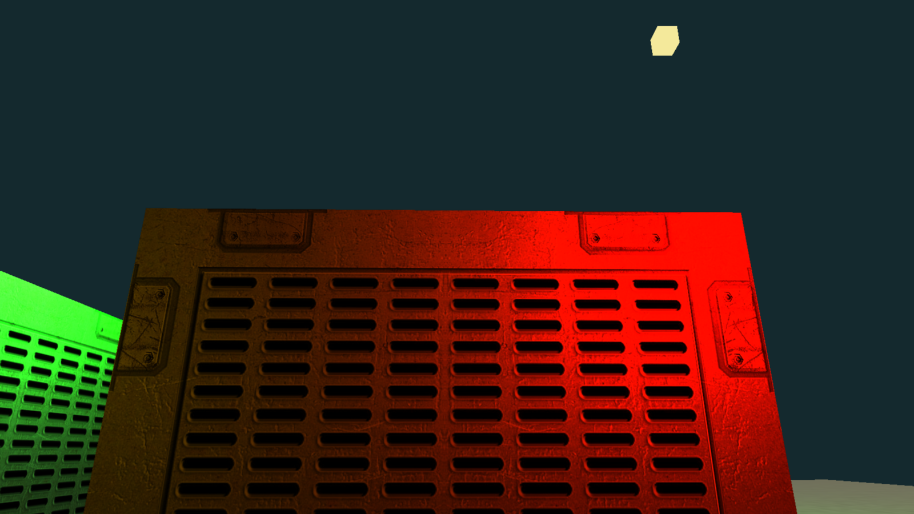

# ModernGL and OpenGL API graphics rendering

_An open exploration of modern 3D rendering in ModernGL and OpenGL._

`👀 Be an early user on my discord for discussions on OpenGL and game development. I'll also be in the ModernGL discord too. - Charlie` <https://discord.gg/Bkhpm8QQ>

The sections in this readme are divided into demo areas like this:

- Python 3.12.10, ModernGL, and Pygame
- OpenGL C++23, Cmake 4.0, and GLFW

In each division, I've written a summary of the code eco-system and setup guide for newbies; then a series of subsections with code demonstrations of techniques with an associated code folder provided in this repo for you to explore.

It is accessible to skip to what section you want to read, however It might be better to stick around and work through the whole doc; I leave that up to you and am grateful for your time.

## Python 3.12.10, ModernGL, and Pygame

Python is simple to configure with pip, and the ModernGL library wraps OpenGL in Python.

Since the base module is compiled in C, the python wrapper provided by ModernGL is still fast. A link to the ModernGL documentation: <https://moderngl.readthedocs.io/en/latest/reference/moderngl.html>.

Pygame is a set of Python modules designed for video games. It includes graphics and sound libraries designed to be used with the Python. This with ModernGL make a perfect pair of libraries to create 3D graphics and games in Python.

To install do the following:

1. Download Python: <https://www.python.org/downloads/release/python-3133/> and extract to a directory and add the bin path to your system PATH; I use `c:/python/bin`.

2. In a console enter `pip install -r requirements.txt`, from inside the project directory, to fetch the packages to your global python installation.

3. If you would rather use virtual environments, and not your global environment, then set it up like the following:

    ```bat
    python -m venv venv
    call venv\Scripts\activate
    pip install -r requirements.txt
    ```

    First it creates the virtual environment, activates it in the terminal, and installs the packages from the `requirements.txt` file to that environment.

4. To run an example use `python main.py` from any of the project sub-directories.

Each project is a standalone example of a 3D rendering technique or feature working with Python 3.12.10. Some projects are combined to create a complex scene. Each project is self-contained and can run independently:

- Series 1 will follow Blinn-Phong illumination, for basic illumination principles.

- Series 2 will look at full BRDFs including Cook-Torrance and BRDF workflows; and detail enhance techniques that are work load friendly.

- Series 3 looks at terrain concepts such as height maps, geometry shaders for billboards, and chunking.

- Series 4 looks at post-processing and other techniques to enhance the visual fidelity, such as anti-aliasing.

- Series 5 for environment effects from simple skybox cube-maps to environment mapping, and volumetric clouds.

- Series 6 will look at model such as `obj`, and how to import and work with them.

- Series 7 for techniques to improve render times and increase efficiency.

Geneal controls used:

- `ESC` - Exit
- `F1` - Toggle Pause time
- `F3` - Toggle view of wire-frames
- `F11` - Toggle full screen
- `WASD` - [Forward, Left, Backward, Right] flying camera movement
- `Mouse Move` - camera look movement
- Press `f` to toggle the flash light.
- Press `F2` to toggle the global light source.
- Press `F4` to toggle local light sources.
- Press `F5` to toggle local texture blend.

### Series 1 - Simple illumination

Simple illumination models that to start with when learning about 3D and lighting; including shadow-mapping for casting shadows on the scene objects, and multiple light local sources that blend into the scene lighting.

A _bidirectional reflectance distribution function_ (BRDF) is a function that defines how light from a source is reflected off an opaque surface. These are written and used in real-time rendering to accomplish semi or full realism but perhaps with some additional trickery or artistry.

A quick note on _Physically Based Rendering_ (PBR) which often gets thrown around interchangeable with BRDF and realtime rendering. I would say that PBR workflows such as from Disney white paper in 2012 focus on realistic rendering, that is not realtime, and more for movie production and other high quality rendering. Get the PDF from Disney here:
<https://media.disneyanimation.com/uploads/production/publication_asset/48/asset/s2012_pbs_disney_brdf_notes_v3.pdf>

The advantages for the massive time cost that some say is days worth of rendering for a single frame in final production rendering, is that the illumination and shadows can all be modelled in one algorithm.

The modern implementations have moved from ray-tracing to a method named path-tracing, so you can dig into that topic as you wish. Usually these methods are bound to CPU solutions, however as graphics hardware has changed we have seen advancements that can push the some algorithms to GPU hardware in the rendering pipeline or via compute shaders.

I focus on BRDF and real time rendering in these materials: we start with Blinn-Phong and then move to Cook-Torrance.

#### py_1.a_blinn-phong - Blinn-Phong

This arrived much later from Phong or the extension from Blinn known as Blinn-Phong. They were build in the same manor but predating the notation.

Blinn's model is an approximate of Phong shading, which had an internal issue rendering reflected light more than 90 degrees from the view and the reflection vectors, that made the light look 'cut-off'. The approximation to use the half-way vector corrected this flaw, producing a more realistic illumination model.


_With only global lights on the shadows are pitch black. The global light at this angle of the camera is producing specular reflections on the cubes. The metallic cube has a higher specular level than the others and produces more of the effect._

This demo creates a cube mesh from scratch, reuses it as bound to a vertex array object with a vert and frag shader program. I combined multiple rendering techniques in this example:

- I apply the illumination model described by the _Blinn-Phong_ model from 1975.

- Global illumination as a directional light, local illumination as point lights and spot lights.

- Shadow map generation for the shadows cast from the global light.

- Organized parameters where the lights have strength and color, and the cube objects have a material definition of albedo, diffuse, and specular properties, in addition to texture map.


_With only local point lights on, the effect of those lights are stronger on the scene; however, they have strength attenuation so do not produce a strong effect on the materials without increasing the light strengths._

In some apps, the light has a set of properties that include the albedo, diffuse, and specular value. The albedo is the base color of the light, the diffuse is how rough or smooth it is, the specular is how much direct reflection there is. However, I believe this is better to associate the albedo, diffuse, and specular values with the objects.

This arrangement makes it possible to create multiple objects later on with their own properties; which is a good precursor to PBR and the Cook-Torrance brdf. So in my demo look for the attenuation calculation in my `default.frag`, and the resulting radiance value: this will be multiplied into the ambient + diffuse + specular result.

If you change the light strength to 0 or turn the lights off with the hotkeys, you will see the resulting illumination in the scene is pitch black. You can play with the albedo, diffuse, and specular properties of the cubes.

This example adds texture mapping to the object mesh of each cube. This is a trick that creates the illusion of detail where there isn't anything other than flat quads. The texture is a 2D image that is mapped to the surface of the cube using texture coordinates. The texture coordinates are stored in the VBO along with the vertices of the cube.


_Both global illumination and local illumination on._

A shadow map casting system is also added for the global light. A shadow map is a depth buffer that is rendered from the perspective of the light source. The depth buffer is then used to determine if a pixel on the cube is in shadow or not. If the pixel is in shadow, it is darkened; if it is not in shadow, it is illuminated.

A two pass rendering system is used to create shadows in the scene. The first pass renders the scene from the perspective of the light source to create a shadow map. The second pass renders the scene from the perspective of the camera and uses the shadow map to determine if a pixel is in shadow or not.

I have included several local point light sources in this demo. The point lights can blend into the casted shadows, which is why you see some color on the floor and the cubes when they are in shadow.

The flash light can be switched on, which is modelled as a spot-light with the direction set to the camera. A technique to soften the edges is used by providing two angles of the light, as the inner and outer angles. Without added a shadow map for each desired light, it is not possible to add multiple casted shadows.


_With the global and point lights off and the flash light on._

Reading:

- LearnOpenGL on lighting: <https://learnopengl.com/Lighting/Colors>.
- LearnOpenGL on advanced lighting and Blinn-Phong: <https://learnopengl.com/Advanced-Lighting/Advanced-Lighting>.
- LearnOpenGL on shadow-maps: <https://learnopengl.com/Advanced-Lighting/Shadows/Shadow-Mapping>.
- On Blinn-Phong <https://interplayoflight.wordpress.com/2013/12/23/an-educational-normalised-blinn-phong-shader/>.
- On shadow mapping: <https://www.opengl-tutorial.org/intermediate-tutorials/tutorial-16-shadow-mapping/>.

### Series 2 - Advanced BRDF illumination

Complex illumination models that can handle different materials of objects as well as more realistic lighting. We keep an eye on performance, and can demonstrate techniques to cheat the eye, such as bump mapping and parallax mapping to add detail onto simple surfaces without adding triangles.

#### py_2.a_cook-torrance - Cook-Torrance

In 1982, Robert Cook and Kenneth Torrance published a reflectance model that is claimed to more accurately represent the physical reality of light compared to others such as the Blinn-Phong model.


_At first glance the Cook-Torrance model appears a little darker than Blinn-Phong. when we view a metallic surface at a sharp angle facing the light we see a brilliant specular reflection._

For more realism in the model, the computation of the BRDF is more complex. The Cook-Torrance model assumes a surface is composed of tiny micro-facets, each acting as a perfect mirror reflecting light. These micro-facets vary in orientation, producing a range of reflection behaviors from diffuse (rough surfaces) to specular (smooth surfaces).

The model is physically grounded, adhering to principles like energy conservation and reciprocity, and it produces realistic highlights and material appearances under different lighting conditions.


_When the local point lights are viewed without the global light, the reflective properties are clearer to see. With the textures disabled we see the illumination fully._

I continue the format presented in the Blinn-Phong demo, where we have global illumination with cast shadows, a series of local point lights, and a flash light modelled as a spot light from the camera direction.


_Point blank flashlight produces a nice effect from the metallic surfaces._

In summary the Cook-Torrance BRDF combines these components:

- A diffuse component for scattered, non-directional reflection (e.g., matte surfaces).

- A specular component for directional, glossy reflections, modeled using micro-facet theory.

Generally, and in this demo, the Cook-Torrance method uses a diffuse Lambertian component and a specular component driven by three terms:

- Beckmann micro-facet distribution.

- Fresnel reflectance.

- Geometry shadowing/masking.

Reading:

- LearnOpenGL on Cook-Torrance: <https://learnopengl.com/PBR/Theory>.
- Cook-Torrance theory: <http://www.codinglabs.net/article_physically_based_rendering_cook_torrance.aspx>.
- LearnOpenGL on shadow-maps: <https://learnopengl.com/Advanced-Lighting/Shadows/Shadow-Mapping>.

#### py_2.b_bump_maps - Bump mapping

This technique specifically applies to surfaces with per frag textures, known as normal maps.

With some mathematical computation in the tangent space, you can easily prepare the needed values for the bump mapping effect.



_The left has the flat surface, right is with bump mapping. Disabling the textures reveals the raw illumination and the reaction to the faked surface details._

Look for the T, B, and N matrix space calculations in `default.vert`, and then the application of this onto the bump map xyz values in `default.frag`.

In order to apply the tangent space matrices to apply the bump to the bump map texture correctly, we must provide the tangent values to the normals. This is easier to precompute as show in the `compute_tangents` function in the core.

This is a super handy way of computing the tangent and bi-tangent and ship them with the VBO. In the case of a model file these could be provided. Joey from LearnOpenGL has a great section on this.

A note on normal map formats since there are two different ones: the DirectX and OpenGL formats. In the textures folder I have an example of each in the `brick_bump.dx.png` and `brick_bump.gl.png` images, for example.


_Top of the partition: the DX format for normals, bottom is GL format. You can tell the difference by where the light green hues are. In my opinion the GL format is more intuitive._

In the `/tools/convert_dx_normal.py` script you can convert from DX to GL format with a simple python tool I wrote. It simply inverts the y-component (green channel) of the image.

A usage example from the tools folder is:
```BAT
pip install Pillow numpy
python dx_to_gl.py --input ../textures/wood_bump_dx.png --output ../textures/wood_bump_gl.png
```

Reading:

- OpenGL tutorial on normal mapping: <https://www.opengl-tutorial.org/intermediate-tutorials/tutorial-13-normal-mapping/>.
- LearnOpenGL on normal mapping: <https://learnopengl.com/Advanced-Lighting/Normal-Mapping>.
- PolyHaven for textures: <https://polyhaven.com/textures/wood>.

#### py_2.c_displacement_maps - Displacement mapping

Displacement mapping can further apply detail to simple surfaces by moving the texture coordinates and the results are impressive.

From the guides out there, you can see a progression from parallax displacement, to steep parallax displacement, and then to parallax occlusion displacement. Each advancement makes the result look better.




_The left has the flat surface, then the bump mapped one, and to the right is with both parallax and bump mapping._

A note on normal map formats since there are two different ones: the depth and the height ones.

In the `/tools/invert_displacement.py` script you can invert the height component of the image, since some sources will have height as depths and causes more math in the frag.

A usage example from the tools folder is:
```BAT
pip install Pillow numpy
python invert_displacement.py --input ../textures/stone_brick_wall_disp.png --output ../textures/stone_brick_wall_disp.png
```

Reading:

- ATI pdf from a talk on modern parallax occlusion mapping <https://web.engr.oregonstate.edu/~mjb/cs557/Projects/Papers/Parallax_Occlusion_Mapping.pdf>.
- Nvidia: <https://developer.nvidia.com/gpugems/gpugems2/part-i-geometric-complexity/chapter-8-pixel-displacement-mapping-distance-functions>.
- LearnOpenGL: <https://learnopengl.com/Advanced-Lighting/Parallax-Mapping>.

### Series 3 - Terrain rendering

Complex data structures to represent the ground, flora, and everything else to make the outdoors scenes.

#### py_3.a_terrain - Terrain rendering

I've combined several techniques to render a ground plane with the 'height map' technique. I have also used 'bill-boards' in the geometry shader to create the flora; and have added the techniques to render a sky and clouds.


_The illumination properties are working nicely. We can also cast shadows onto the billboards, with a similar calculation of the shadow coordinate for each of the vertices in the quad._

The ground plane is created from a height map and displaced in the vertex shader. The normals of the ground plane are calculated in the geometry shader and passed to the fragment shader for lighting calculations.

Grass in complex scenes isn't modelled from a 3D mesh, but rather a series of 2D planes called bill-boards.

The grass is created along each point on the ground plane using a geometry shader and a flow map to simulate wind movement. We can use the shader programs to render more complex objects such as grass.

The wind movement on the grass is simulated using a 'flow map', which is a 2D texture that is used to control the movement of the wind. The flow map is used to offset the position of the grass in the geometry shader. 


_With only local lights on and textures off, we see the pure light on the normals of the billboards._

In practice, the height map could be procedurally generated or loaded from an image file. The height map is used to displace the vertices of the ground plane in the vertex shader, and this creates the effect of a 3D ground plane.

For optimization we have to divide the terrain into chunks and manage them just as other objects in the scene.

Reading:

- Terrain mesh and height-map: <https://blogs.igalia.com/itoral/2016/10/13/opengl-terrain-renderer-rendering-the-terrain-mesh/>.
- Grass with wind implementation: <https://vulpinii.github.io/tutorials/grass-modelisation/en/>.
- GPU gems on grass: <https://developer.nvidia.com/gpugems/gpugems/part-i-natural-effects/chapter-7-rendering-countless-blades-waving-grass>.
- Billboard tutorial: <https://vulpinii.github.io/tutorials/grass-modelisation/en/>.
- GPU Gems: <https://developer.nvidia.com/gpugems/gpugems/part-i-natural-effects/chapter-7-rendering-countless-blades-waving-grass>.
- On flow maps: <https://github.com/JaccomoLorenz/godot-flow-map-shader>.

### Series 4 - Anti-aliasing

Without anti-aliasing (AA), the straight edges of objects appear jagged because the pixels on the screen are square and the edges are not aligned with the pixels during rasterization.

The popular techniques have trade-offs between quality and performance:

- MSAA (Multi-Sample Anti-Aliasing) is a cheaper form of SSAA. Instead of going through the process of sampling every pixel, MSAA only comes into play where aliasing could become an issue such as an edge.

- FXAA (Fast Approximate Anti-Aliasing) is a post-processing technique. It is a fast and efficient way to smooth out the edges but it can produce artifacts and blurring.

- TAA (Temporal Anti-Aliasing) uses information from previous frames to smooth out the edges by blending pixel information. It produces average results with blurring, but computationally cheaper than other methods.

#### py_4.1_msaa - Multi-sample anti-aliasing

In ModernGL this is easy to setup with a frame buffer enabled with multi-sampling, since this is a feature in the OpenGL API. We can create the off screen render target with the `samples=X` property. I set this to 8 and 32 samples for comparison, from: 1, 2, 4, 8, 16, and 32.

All we have to do then is copy the pixels to the screen buffer. This method works great for forward rendering but may not work for deferred rendering methods.


_No aliasing can be seen with 8x samples, however the blur is strong. The problem area would be the straight edges on further away objects, like the far cube or end of the floor. With MSAA you can see the edges have been smoothed._


_Multi-samples set to 32x for comparison._

Reading:

- LearnOpenGL on anti-aliasing with MSAA: <https://learnopengl.com/Advanced-OpenGL/Anti-Aliasing>.

#### py_4.b_fxaa - Fast approximate anti-aliasing

Using a similar setup to the MSAA demo, we use the offscreen render buffer object for our scene. Instead of relying on the multi-sampling provided by the API we create a post processing shader to handle anti-aliasing.

So look for the changes in the render steps in the code, where instead of `using ctx.copy_framebuffer()` to render the smoothed image to screen, we use a render via a vertex array object that we have created in the PP class.

This VAO has two triangles for indices, forming a square; and a custom shader to handle post processing. In the `post.frag` shader file the FXAA algorithm will look for contrasted pixels and goes from there.

I create my implementation of the FXAA 3.11 version, which I think is the last one developed.

  


_The `fxaa_3.11` method looks to me to be effective for the cheaper cost and complexity compared to MSAA. Debug in yellow for the edges detected by the FXAA 3.11 method._

This example serves another use for our learning: we can use the post processing shader for more features at a later stage.

Reading:

- Siggraph 2011 presentation: <http://iryoku.com/aacourse/downloads/09-FXAA-3.11-in-15-Slides.pptx>.
- Source examples for FXAA 3.11: <https://github.com/mattdesl/glsl-fxaa/blob/master/fxaa.glsl>.
- And <https://github.com/McNopper/OpenGL/blob/master/Example42/shader/fxaa.frag.glsl>.

#### py_4.c_taa - Temporal anti-aliasing

TAA uses frame blending, said to have less cost than SSAA despite it being 3 or 4 passes (I don't believe it). It adds complexity and ghosting artifacts, unlike the purely spatial SSAA or post-processing FXAA/SMAA.



_I have a rudimentary TAA build that uses a 2x2 jitter and the previous frame._

So far I have just a test TAA implementation that is much simpler than the full version. This is a basic two pass setup missing a potential sharpening pass in post processing.

In the root I have included the basic passes in frags for a full implementation of TAA, and will work to include this in the demo. My enthusiasm isn't high as I think TAA looks terrible and adding ghosting and visual delay is a poor compromise to remove jaggies.

Final complaint, the idea of blurring the simulation to then apply edge sharpening seems crazy to me, as a computer vision and graphics guy this seems horrible and a waste of resources.

Reading:

- On TAA from Epic: <https://de45xmedrsdbp.cloudfront.net/Resources/files/TemporalAA_small-59732822.pdf>.
- Writeup from Sugu Lee: <https://sugulee.wordpress.com/2021/06/21/temporal-anti-aliasingtaa-tutorial/>.

#### py_4.d_ssaa - Super-sampling anti-aliasing

**_Demo being built. - Charlie_**

SSAA is a spatial anti-aliasing method that renders a scene at a higher resolution than the display and then down-scales it to the target resolution. By sampling multiple points (sub-pixels) within each pixel, SSAA captures more detailed geometry and texture information, smoothing edges and reducing aliasing artifacts.

Reading:

- SSAA compared to MSAA + FXAA: <https://www.sapphirenation.net/anti-aliasing-comparison-performance-quality>.
- 3DFX white paper: <http://www.x86-secret.com/articles/divers/v5-6000/datasheets/FSAA.pdf>.

#### py_4.e_smaa - Subpixel morphological anti-aliasing

**_Demo being built. - Charlie_**

Reading:

- Computer Graphics Forum, Vol. 31(2), Eurographics 2012: <https://www.iryoku.com/smaa/>.

### Series 5 - Environment rendering

How to add depth and visually represent the environment around the scene. This section will start with the humble cube-map, however this will come back into use when we want to optimize our modern volumetric clouds demo.

#### py_5.a_skybox - Simple old-school skybox

The classic skybox is a set of 6 textures arranged as if inside a cube; interestingly the cube-map textures can be converted from a 360 degree parallax image.

We will continue in the next demo with environment mapping to create reflections of the cube-map on our objects.


_The cube-map appears seamless. However, in such a simple demo there is no movement of the background._

The source images were generated to standard cube map from a HDRI image using this handy website: <https://matheowis.github.io/HDRI-to-CubeMap/>.

The original HDRI image used was sourced from: <https://polyhaven.com/hdris/skies>.

In this demo look for the `Skybox` class added to the `core` python code. It is instanced in the main app, and used in the render function of the scene class.

Reading:

- LearnOpenGL on cube-maps: <https://learnopengl.com/Advanced-OpenGL/Cubemaps>.

#### py_5.b_env_map - Environment mapping

So this is interesting, because OpenGL has reflect and refractive functions available in the shades. They are easy to call and use to calculate the ray that hits the cube map, reflected from the source to the surface normal.


_Creating a reflective material property and applying it with the sky box gives nice results._

My first attempt left me a little confused what to do with this and what light source reflects what part of the cube map, then I decided to create a new material property to describe this feature as reflectivity. This property when set to 1.0 will mix a perfect reflection of the cube map, in this case the sky box.


_First the test sky box shows the reflection of the BACK face of the test cube map, into the scene cube object I added with 1.0 reflectivity. The orangeness is due to the red and yellow lights behind the camera._


_With the local lights turned off, shows the mixing keeps all lighting and shadows as before demos in this repo. With all lights on, just shows the different surface interactions with the local lights. In this example the reflection seems more subtle due to to more sparse cloud coverage._

In the default shader, I wrote a new section for the reflectivity, look for the skybox_reflection value. I have decided to mix this into the texture color, which means that a value of 1.0 would effectively replace the texture.

The obvious extension to the material definition, that I provide per object as of now, is to create a set of texture maps for the albedo, diffuse, metallic, and reflectivity values.

Finally, I add illumination properties to the skybox shader to allow the global light to take effect on the environment using the values we have. Look for changes in the skybox frag shader, and note that we remove the shadow casting capability as well as specular reflective properties, as well as anything based on the flat surface of the cube.

I apply the illumination uniformly. This also found it's way into the default shader too, for the reflections; but what it allows is dynamic modification of the environment map, something that we will use more in the next demos.


_An example with all lights on and just global light on (top). The skybox has been given a material and has illumination; this also needs to be done in the reflections so as to compose the correct colors. If we change the global light, such as to to 0.25 instead of 5.0, fairly dark, we see the effect of everything working together (bottom)._

This does mean if we turn the global light off, the skybox will be pitch black which makes visual and logical sense.

Reading:

- LearnOpenGL on cube-maps second part on environment-mapping : <https://learnopengl.com/Advanced-OpenGL/Cubemaps>.

#### py_5.c_volumetric_clouds - Volumetric clouds

**_Demo being built. - Charlie_**

Reading:

- Useful resources on volumetric clouds: <https://gist.github.com/pixelsnafu/e3904c49cbd8ff52cb53d95ceda3980e>.

### Series 6 - Model files

How to load model files and make them work in our engine.

#### py_6.a_obj - Wavefront Obj files

Just simple models available free from: <https://free3d.com/3d-models/obj-textures>.


_These particular models are simple with a texture and uv-mapping information._

In this demo look for the `Obj` class added to the `core` python code, and the `PrototypeObj` class used for caching the mesh. Instanced and used in the render function of the scene class.

### Series 7 - Alternative rendering and efficiency

Concepts such as deferred rendering and other techniques to be considered for improving render times.

#### py_7.a_deferred_rendering - Deferred rendering

**_Demo being built. - Charlie_**

Deferred rendering reduces the complexity for illumination and other stages by first figuring out which fragments actually need to be processed, thereby removing redundant rendering and improving render times.

In the classic 3D rendering text it is a screen-space shading technique that is performed on a second rendering pass, after the vertex and pixel shaders are rendered, first suggested by Michael Deering in 1988.

A disadvantage of deferred rendering is the inability to handle transparency within the algorithm, although this problem is a generic one in Z-buffered scenes and it tends to be handled by delaying and sorting the rendering of transparent portions of the scene.

Deferred shading is based on postponing lighting to a later stage, and having precomputed the fragment areas that need it. There are two passes: the geometry pass, then the lighting pass.

In the first pass the scene is rendered without lighting into the Geometry-buffer or G-buffer. The geometric information of a scene stored in the G-buffer is then used in the second pass for the lighting calculations.

This would mean that every light in the scene needs to have it's illumination projected with the g-buffer, which causes degradation on the performance. However some extension on this approach are deferred lighting and tile-based deferred shading.


_So far just a simple demo but this will be rewritten to use the full cube and illumination setup from previous demos in this repo, so we could then compare the frame render time._

Reading:

- Learn OpenGL on deferred shading: <https://learnopengl.com/advanced-lighting/deferred-shading>.
- A primer on efficient rendering: <https://www.aortiz.me/2018/12/21/CG.html#forward-shading>.
- Valve developer community on Deferred renderer: <https://developer.valvesoftware.com/wiki/Deferred_renderer>.
- Leif Node on tiled deferred rendering: <https://leifnode.com/2015/05/tiled-deferred-shading/>. 

## OpenGL C++23, Cmake 4.0, and GLFW

Each project is a standalone example working with C++23 GNU, and CMake 4.
If you know what to do and don't need any flavour then skip down to the projects; otherwise if you want tips for Windows development then read on.

I have used the modern _FetchContent_ feature from CMake to pull the libraries from their respective repositories where possible in these projects. As of now, GLAD is provided pre-configured. I have OpenGL at core 4.6, therefore these files are added to the `external` directory of the project.

The _Khronos OpenGL Specification_ is available in pdf:
<https://registry.khronos.org/OpenGL/specs/gl/glspec46.core.pdf>.

A list of hardware that supports this is available via Khronos: <https://www.khronos.org/conformance/adopters/conformant-products/opengl>.

Here is how you can setup a new project, or continue reading for a description of how I structured mine.

1. Create a project directory, and inside here we do the following:

    - Don't use spaces in the project name for full compatibility, especially if you are using my build batch files.

    - A `CMakeLists.txt` file at the root of your project.

    - A `src` directory for your code.

    - A `src/main.cpp` file to start your application.

    - An `external` directory for any external libraries you need. Note that I have placed this one level up from the root of each project so that it can be shared across multiple projects.
    
    - This is the same for the `asset` directory, which you will use to store assets like textures and models. You can place this inside the root if you like, but remember this when you are configuring your build.

2. You will need to install Cmake 4.0.x: <https://cmake.org/download/>, and add the bin folder to your _PATH_, for example I have added `C:\Cmake\bin` to my PATH.

    - Test for the installation by running `cmake --version` in a terminal.

    - If you want to use your older version then fine, but looking at the deprecation warnings and the issues you will have with version policies. I recommend to just update and avoid all of it.

3. You will need to install a compiler, I'm going to point you to 64 bit GNU `gcc` and `g++` compilers from MinGW:

    - Install `MinGW Portable C, C++, and Fortran Development Kit for x64` from: <https://github.com/skeeto/w64devkit>. I use directory `C:/MinGW`.

    - Add the bin folder of MinGW Portable to your _PATH_ environment variable, such as `C:\MinGW\bin`.

    - Test for the installation by running `gcc --version` or `g++ --version` in a terminal.

    - An additional compiler that replaces `GNU make` is `ninja` developed by _Google_ in 2012. Said to be significantly faster on larger projects.

    - Get the release from: <https://github.com/ninja-build/ninja>. If you want to use this install MinGW first and then copy the `ninja.exe` into the `C:\MinGW\bin` directory.

    - Test for the installation by running `ninja --version` in a terminal.

4. If you are not using the OpenGL files that I have included, setup your own using the GLAD web-service:

    - Go to: <https://gen.glad.sh/> and select GL and the version you want and click _generate_.

    - Download the zip file and place the include and src into your project folder.

    - The `gl.c` file needs to be where your main source file is in the `src` folder. Put the `lib` and `include` directories inside the `external` directory of your project.

    View of the project structure is as follows:

    ```
    parent
    ├──external/
    │   ├── glad/
    │   │   └── gl.h
    │   └── KHR/
    │       └── khrplatform.h
    └── project
        ├──src/
        │    ├── main.cpp
        │    └── gl.c
        └── CMakeLists.txt
    ```

    In more advanced examples I put OpenGL related helper source code into `opengl_glfw`, with the `gl.c` file as well like this:

    ```
    parent
    ├──external/
    │   ├── glad/
    │   │   └── gl.h
    │   └── KHR/
    │       └── khrplatform.h
    └── project
        ├──src/
        │    ├── main.cpp
        │    ├── app.cpp
        │    └── opengl_glfw/
        |           └── gl.c
        |           └── <engine code>
        └── CMakeLists.txt
    ```

    Again, note that in my examples the `external` directory is another level up for sharing across all projects.

5. To create the build files, you have some options. Although I've used them all, I prefer the first option:

    - **_Recommended_** Use the `.bat` files that I have created for building, compiling, and running the application:

        - So with a terminal run `build development` to create the Cmake build and then `compile development` to compile the executable. If you changed where `external` is you need to modify the `build.bat` script to point where you have it relative to your `CMakeLists.txt`.

        - I added flags to control the builds, so use `debug`, `development`, or `release` as you wish. Debug will enable debug flags in the compiler, but code will be slower. Development for fast runtime inside your dev environment. Release for when you move the resources to the deployment build.

        - If you want to use ninja then use `build development ninja` and `compile development ninja`.

        - I also added a `run.bat` file to call the exe from the correct build directory, for the lazy like me.

        - Open the `.bat` files to see the commands used and make use of them in a terminal.

        - Remember if you add or rename source files, you will need to build before compiling.

    - **_Or_** A direct command line call for a build with GNU Make and Cmake is like this:

        ```bat
        call cmake ^
        -DCMAKE_BUILD_TYPE:STRING="Development" ^
        -DCMAKE_C_COMPILER:FILEPATH="gcc.exe" ^
        -DCMAKE_CXX_COMPILER:FILEPATH="g++.exe" ^
        -DCMAKE_EXPORT_COMPILE_COMMANDS=1 ^
        -S . ^
        -B ./build ^
        -G "MinGW Makefiles"
        ```

        Replace `-G "MinGW Makefiles"` with `-G Ninja` if you want to use ninja.

        Note that in Windows the `^` character is used for line continuation.

        To compile the executable from the project directory, you can use the following commands in a terminal:

        ```bat
        cd build
        call make
        ```

        or with ninja:

        ```bat
        cd build
        call ninja -j4
        ```

        then call the `app.exe` to run it.

    - **_Or_** use the CMake extension in VS Code to configure the build. Open the `CMakeLists.txt` file, and in the command palette (Ctrl+Shift+P), type "CMake: Select Kit" and press Enter. This will open a list of kits like MinGW and MSVC if you have them. The settings will build when you open or edit the _CMakeLists_ file from here on out. You can use the debug or run buttons on the bottom bar to handle compiling.

    - **_Or_** you can use the Cmake gui (in your start programs) to create the build configuration by selecting the project and build directories and the compiler to use for a project that has a `CMakeLists.txt` file. Handy if you don't want GNU or command line. From here you can click generate and exit out. Then you can open the `SLN` file in the build directory if you selected MSVC or Visual Studio as your compiler.

6. On formatting I'm using VSCode and the C++ extension from Microsoft, and it is easy to set the style. I prefer the google format which tidies up the braces. If you want to match this then find the setting for `c_Cpp Clang_fallback_format style` and set it: `{ BasedOnStyle: Google, IndentWidth: 4, ColumnLimit: 0 }`.

### cpp_ogl_1.a_triangle - Basic window and triangle

This demo is almost raw code from the starter project from GLFW: <https://www.glfw.org/docs/latest/quick_guide.html#quick_example>.

However, I have added the GLM library and FMT library, and a child class, all to fully demonstrate the CMake build process and has everything correctly working.

I have also added code to center the window in the screen. Note that the code is left as a single file with inline shader program code, for simplicity. In the next demo the code will be separated out.


### cpp_ogl_2.a_going_3d - Pyramid and code structure

This demo is my clean and modern implementation of demo 07 from: <https://www.youtube.com/playlist?list=PLPaoO-vpZnumdcb4tZc4x5Q-v7CkrQ6M->.

Victor Gordon's youtube and github repo are excellent reworking of the mind-blowing tutorials from LearnOpenGL: <https://learnopengl.com/Getting-started/Textures>.

In this demo we render a texture onto a 3D mesh, we write a shader to render the texture.


